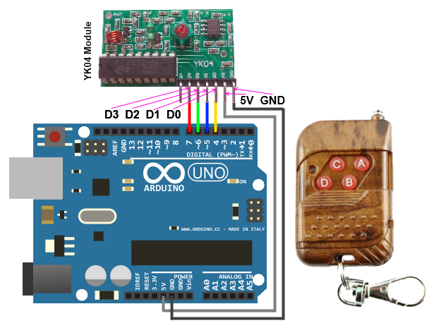

# YK04 Controller Library

For Arduino boards.

The library implements a set of methods for working with a remote control 
sensors based on the YK04 driver.

The transmitter operates at a frequency of 315 MHz. It has four buttons, 
and therefore can control four loads. The board with a battery (23A, 12V) 
is placed in a convenient plastic case-keychain. It has a telescopic antenna, 
which will increase the range of signal transmission. There is protection 
against accidental pressing the buttons. It is realized with the help 
of a sliding cover.

## Installation

1. [Download](https://github.com/YuriiSalimov/YK04_Controller/releases) the Latest release from GitHub.
2. Unzip and modify the Folder name to "YK04_Controller" (Remove the '-version')
3. Paste the modified folder on your Library folder 
(On your `libraries` folder inside Sketchbooks or Arduino software).
4. Restart the Arduino IDE.

## Circuit Diagram



## Methods

```cpp
	/**
		Digital ports pins:
			@param A_pin - A button (D0).
			@param B_pin - B button (D1).
			@param C_pin - C button (D2).
			@param D_pin - D button (D3).
	*/
	YK04_Module sensor(A_PIN, B_PIN, C_PIN, D_PIN);
	
	/**
		If you want to invert a sensor signal:
		INVERT_SIGNAL:
			true - invert a signal;
			false - not invert a signal.
	*/
	YK04_Module sensor(A_PIN, B_PIN, C_PIN, D_PIN, INVERT_SIGNAL);

	/**
		Single reading of the remote control.
		If the remote control is clamped, 
		value of the next pressing - NOT.
		Return value of pressing the remote control:
			Button::A - A button is pressed;
			Button::B - B button is pressed;
			Button::C - C button is pressed;
			Button::D - D button is pressed;
			Button::NOT - not pressed.
	*/
	sensor.singleRead();

	/**
		Multiple reading of the remote control.
		If the remote control is clamped,
		returns a pressed button value.
		Return value of pressing the remote control:
			Button::A - A button is pressed;
			Button::B - B button is pressed;
			Button::C - C button is pressed;
			Button::D - D button is pressed;
			Button::NOT - not pressed.
	*/
	sensor.multipleRead();
	
	/**
		Checks if the A button is pressed.
		Return true - button is pressed, 
		false - button is not pressed.
	*/
	sensor.isA();

	/**
		Checks if the B button is pressed.
		Return true - button is pressed, 
		false - button is not pressed.
	*/
	sensor.isB();

	/**
		Checks if the C button is pressed.
		Return true - button is pressed, 
		false - button is not pressed.
	*/
	sensor.isC();

	/**
		Checks if the D button is pressed.
		Return true - button is pressed, 
		false - button is not pressed.
	*/
	sensor.isD();
```

Created by Yurii Salimov.
